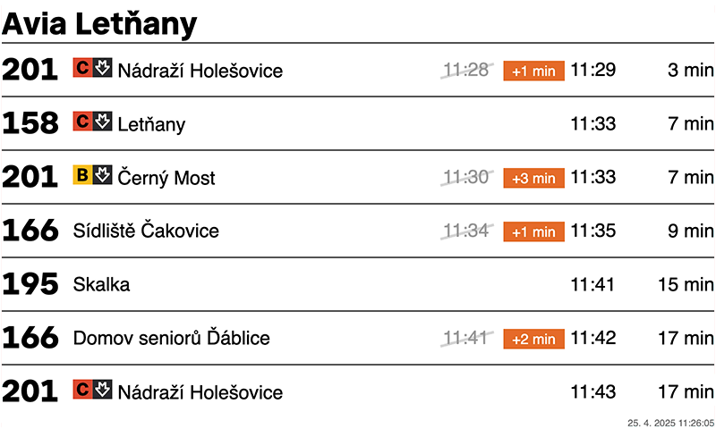
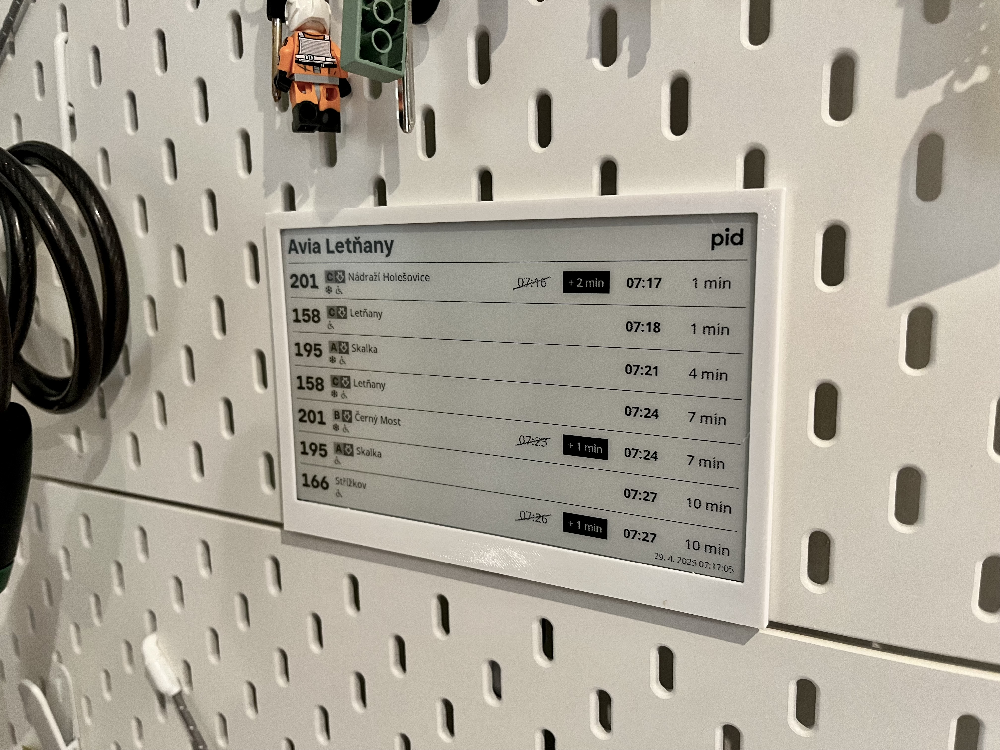

## PID e-ink Board - Server side (php)
- This is one part of that project, see also [second part - local on rPi](https://github.com/dariokolar/PIDeink-rPi).

## Introduction
- This project obtain power limitation of raspberryPi Zero (rPi)
- Via this PHP script, we can prepare image with departure board on server, and deliver it on request made by python script on rPi that download current image from url and display it on e-ink display (via library provided by manufacturer)

## HW/SW needed
- [raspberryPi Zero with HAT](https://rpishop.cz/535843/raspberry-pi-zero-2-w-s-pripajenym-gpio-headerem/)
- [Waveshare 7.5" e-Paper display](https://rpishop.cz/e-paper-karty-hat/1049-waveshare-75-epaper-display-for-raspberry-pi.html)
- server that runs PHP with Imagick
- (optional) 3D printed frame for our display (stl of one that can be used on IKEA Skadis pegboard is avalible on [printables](https://www.printables.com/model/1321105-skadis-frame-for-waveshare-75-e-paper-display))

## Basic workflow
1. cron on rPi runs [python](https://github.com/dariokolar/PIDeink-rPi) script every minute
2. that script will request image from our server via url
3. server will request Prague Public Transport api and get current departure data
4. server will create image of departure board with that current data and display it
5. python script on rPi will download that image and send it on e-ink display (with use of manufacturer python library)

